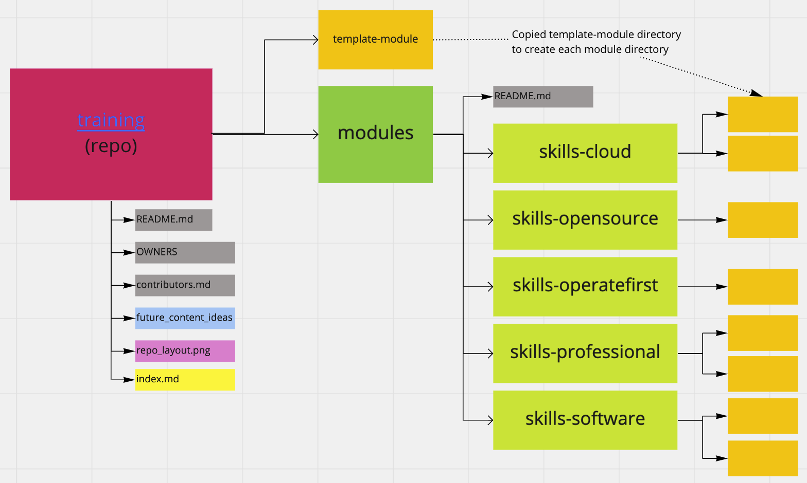

# Operate First *training* repo

This repository is the content source for training in the Operate First community. We develop training content here and publish training modules to operate-first.cloud (FIXME - need URL).

## What do we mean "training content"?

Training content is:

* Self-paced, interactive experiences designed to train people on how to perform some action or improve performance on that action.

* Created in small, modular units aligned with only 1 or 2 objective ("After completing this training, you should be able to [OBJECTIVE]...")

* Designed to apply [instructional design best practices](https://blog.commlabindia.com/elearning-design/instructional-design-best-practices-guide) and [Adult Learning Theory (andragogy)](https://en.wikipedia.org/wiki/Andragogy).

Training content ***is not***:

* Documentation. Training is an interactive experience that you usually take just one time. A doc is a passive information resource that to reference repeatedly after training. (TIP: Use training as an introduction to how to find/use docs for ongoing reference.)

* Always comprehensive and up-to-date. This training content is created and maintained as the community members are able to do so. The community can prioritize creating/updating training depending on its current community goals.

## How do we build training?

Training is divided up into units called **training modules**

Each module:
* Is self-contained within a directory.
* Is developed using Jupyter Book.
* Covers 1-2 learning objectives (*"After completing this training, you should be able to..."*).

On commit of this training repo... [FIXME - build and publish process TBD]

## Where can people find and take the training content?

Operate First has a training landing page available at (FIXME-TBD training.operate-first.com?). Learners should not need to access this developer-side repository to access or complete their training.

## Repository organization

Repository contents are organized to reflect how content is organized at (FIXME-TBD training.operate-first.com?).

General directory structure:

*index.md* - A markdown file used to index all available training modules.

**template-module** - A directory with a pre-configured Jupyter Book that you can copy to create a new training module.

**modules** - The directory containing all individual training modules, organized into subdirectories based on these skill areas:

* **skills-operatefirst** - Operate First overviews, onboarding, and tools
* **skills-opensource** - Open source
* **skills-software** - Software development
* **skills-cloud** - Cloud technology and operations
* **skills-professional** - General professional/on-the-job skills for team environments (e.g. agile, communication, handling feedback)

## How to contribute training content

If you aren't yet a member of the Operate First community in GitHub, [start here](https://github.com/operate-first/common/blob/main/docs/add_gh_member_and_access.md#become-a-github-member).

Members can then fork and contribute changes to the repository:
1. Fork this training repository.
2. Check out your fork.
3. If you're creating a new training module, copy *training-module* into one of the modules/skills-* subdirectories. In your new copy, add your title and other information in _config.yaml.
4. Use Jupyter Notebook locally to open the book contents and create and modify files. Follow any guided information in the template. If you're new to Jupyter Book, visit [jupyterbook.org](https://jupyterbook.org/intro.html) for a tutorial and docs so you know how to add pages and test your build locally.
5. Continue working in your fork until you're ready to publish changes, then initiate a pull request in accordance with Operate First's current process.

### License

This repository was created compliant with [ADR 0001](https://www.operate-first.cloud/blueprints/blueprint/docs/adr/0001-use-gpl3-as-license.md). All content within this repository is provided under the [GNU General Public License v3.0 (GPLv3)](https://www.gnu.org/licenses/gpl-3.0.en.html).

